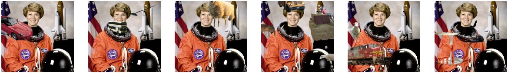

# Synthetic Occlusion Data Augmentation



In computer vision, synthetically augmenting training input images by pasting objects onto them has been shown to improve performance across several tasks, including object detection, facial landmark localization and human pose estimation.

Such pasting is also useful to evaluate a model's robustness to (synthetic) occlusions appearing on the test inputs.

This is the implementation we used in our [IROS'18 workshop paper](https://arxiv.org/abs/1808.09316) to study occlusion-robustness in 3D human pose estimation, and to achieve first place in the 2018 ECCV PoseTrack Challenge on 3D human pose estimation. Method description and detailed results for the latter can be found in [our short paper on arXiv](https://arxiv.org/abs/1809.04987).

Contact: István Sárándi <sarandi@vision.rwth-aachen.de>

## Dependencies 
You'll need the scientific Python stack (with Python 3), OpenCV and Pillow to run this code.

## Usage

```bash

# Clone this repo
git clone https://github.com/isarandi/synthetic-occlusion.git
cd synthetic-occlusion

# Download and extract the Pascal VOC training/validation data (2 GB)
wget http://host.robots.ox.ac.uk/pascal/VOC/voc2012/VOCtrainval_11-May-2012.tar
tar -xf VOCtrainval_11-May-2012.tar

# Test if it works (after some time this should show occluded examples of the "astronaut" image, like above)
./augmentation.py "VOCdevkit/VOC2012"
```

Short example code:

```python 
occluders = load_occluders(pascal_voc_path=PATH_TO_THE_VOC2012_DIR)
example_image = cv2.resize(skimage.data.astronaut(), (256,256))
occluded_image = occlude_with_objects(example_image, occluders)
```


## References

[1] I. Sárándi; T. Linder; K. O. Arras; B. Leibe: "[How Robust is 3D Human Pose Estimation to Occlusion?](https://arxiv.org/abs/1808.09316)" Accepted for IEEE/RSJ Int. Conference on Intelligent Robots and Systems (IROS'18) Workshops, to appear (2018) arXiv:1808.09316

```
@inproceedings{Sarandi18IROSW,
  title = {How Robust is 3{D} Human Pose Estimation to Occlusion?},
  author = {Istv\'an S\'ar\'andi and Timm Linder and Kai O. Arras and Bastian Leibe},
  booktitle = {IEEE/RSJ International Conference on Intelligent Robots and Systems (IROS) Workshops},
  year = {2018},
  note = {arXiv:1808.09316}
}
```

[2] I. Sárándi; T. Linder; K. O. Arras; B. Leibe: "[Synthetic Occlusion Augmentation with Volumetric Heatmaps for the 2018 ECCV PoseTrack Challenge on 3D Human Pose Estimation](https://arxiv.org/abs/1809.04987)" (2018) arXiv:1808.04987

```
@article{Sarandi18PoseTrack,
  title = {Synthetic Occlusion Augmentation with Volumetric Heatmaps for the 2018 {ECCV} {P}ose{T}rack {C}hallenge on 3{D} Human Pose Estimation},
  author = {Istv\'an S\'ar\'andi and Timm Linder and Kai O. Arras and Bastian Leibe},
  journal={arXiv:1809.04987},
  year={2018}
}

[3] N. Dvornik, J. Mairal, C. Schmid: Modeling Visual Context is Key to Augmenting Object Detection Datasets ()
